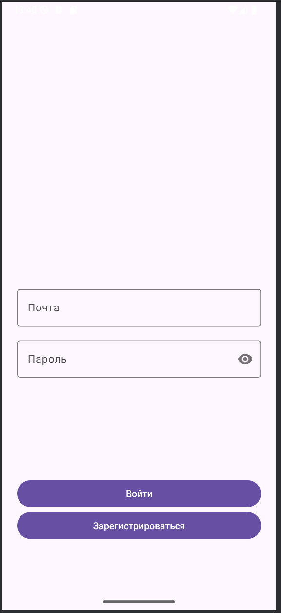
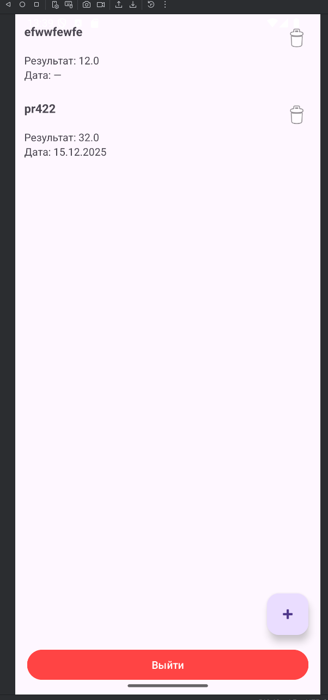
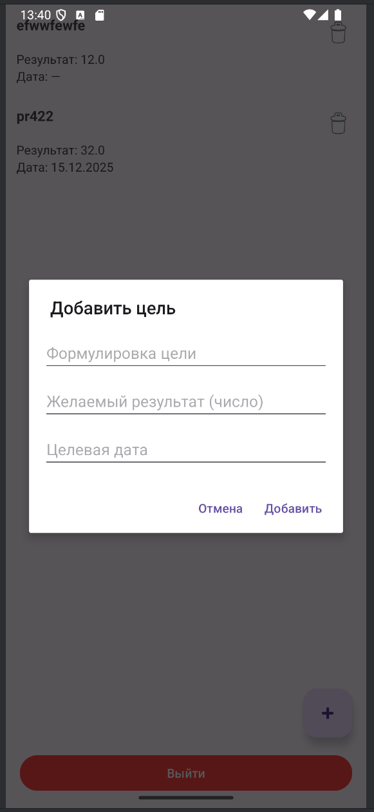
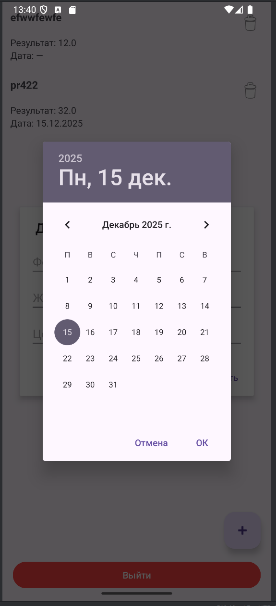

# Supabase Todo App: Вариант №10 (Личные цели)

Android-приложение на Java для управления личными целями с авторизацией через Supabase.
Каждый пользователь работает только со своими данными благодаря Row Level Security (RLS).

Проект выполнен в рамках учебного задания.

---

## Функциональность

- Регистрация и вход пользователя (Supabase Auth)
- Хранение данных в Supabase (PostgreSQL)
- Просмотр списка личных целей
- Добавление новой цели
- Редактирование цели
- Удаление цели
- Выбор даты через DatePicker
- Корректное отображение даты в формате `dd.MM.yyyy`
- Выход из аккаунта (logout)

Каждый пользователь имеет доступ **только к своим записям**.

---

## Структура данных (вариант №10)

Таблица `personal_goals`:
- `id` — идентификатор
- `user_id` — владелец записи
- `goal_text` — формулировка цели
- `desired_result` — желаемый результат (число)
- `target_date` — целевая дата
- `created_at`, `updated_at`

---

## Используемые технологии

- **Java**
- **Android SDK**
- **RecyclerView**
- **HttpURLConnection**
- **ExecutorService + Handler**
- **Supabase**
  - Auth
  - REST API
  - Row Level Security (RLS)
- **Material Components**

---

## Безопасность

- Включён **Row Level Security (RLS)**
- Политики доступа:
  - SELECT / INSERT / UPDATE / DELETE — только для владельца записи (`auth.uid()`)
- Работа с токеном через `SharedPreferences`
- При истечении сессии пользователь перенаправляется на экран входа

---

## Скриншоты

### Экран авторизации

### Список целей

### Добавление цели

### Выбор даты

---

